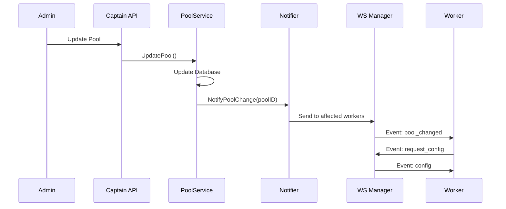
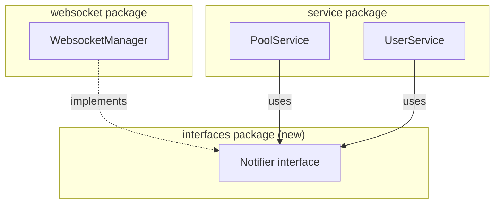
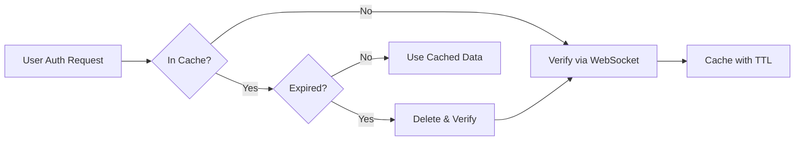
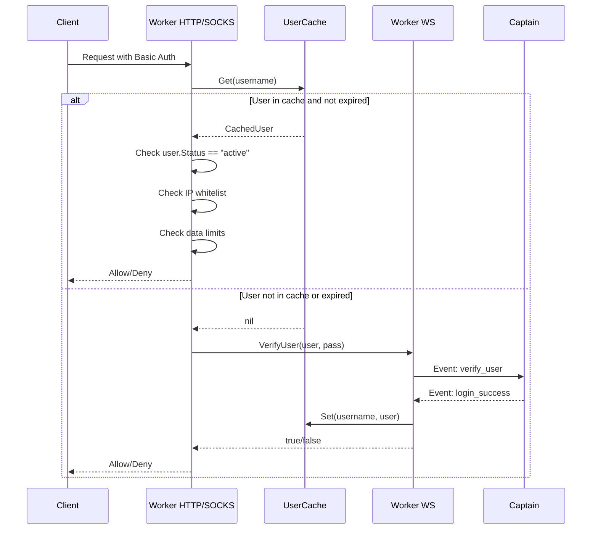
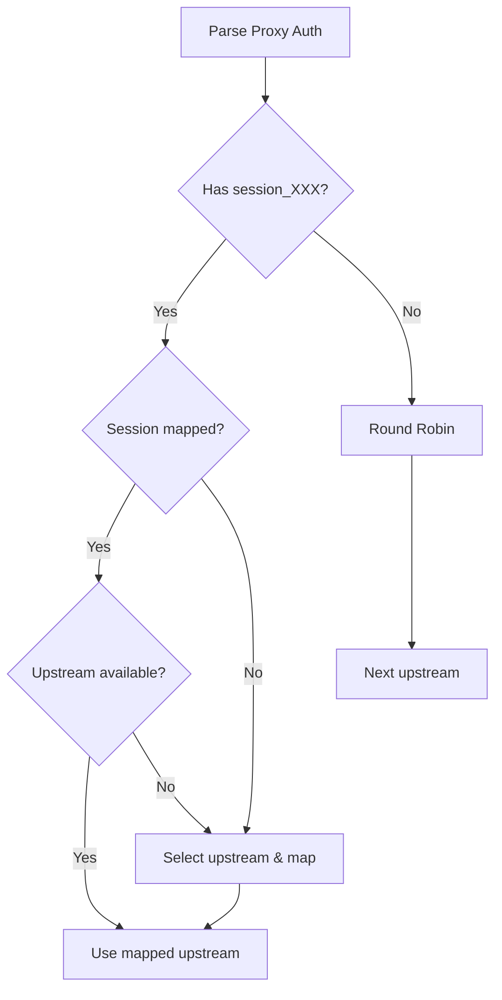
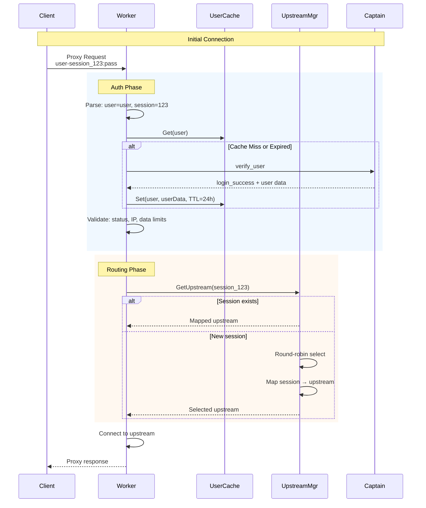

# Complete Worker Architecture Guide

## Table of Contents
1. [Overview](#overview)
2. [Push-Based Database Notifications](#push-based-database-notifications)
3. [Circular Dependency Resolution](#circular-dependency-resolution)
4. [User Data Management with TTL](#user-data-management-with-ttl)
5. [Session Management](#session-management)
6. [Upstream Routing Strategies](#upstream-routing-strategies)
7. [Implementation Checklist](#implementation-checklist)

---

## Overview

This document provides a comprehensive architecture guide for the Worker system, covering:
- Push-based notifications from Captain to Worker
- Resolving the circular dependency between `service` and `websocket` packages
- User data caching with automatic expiration (1-day TTL)
- User request sessions vs proxy string sessions
- Sticky upstream routing based on session ID

---

## Push-Based Database Notifications

### Design Philosophy

**Minimal Acknowledgments** - Only send what's absolutely necessary:
- Pool change → Send notification to affected worker(s)
- User change → Broadcast to all workers

**Worker Reactions:**
- Pool notification → Worker re-requests full configuration
- User notification → Worker deletes cached user; re-fetches on next auth attempt

### Event Types

| Event Type | Direction | Trigger | Worker Action |
|------------|-----------|---------|---------------|
| `pool_changed` | Captain → Worker(s) | Pool config modified | Re-request full config |
| `user_invalidate` | Captain → All Workers | User modified/deleted | Delete cached user |



### Captain-Side Event Payloads

```go
// Minimal payloads - no acknowledgments needed

// Pool changed - just the pool ID
type PoolChangedPayload struct {
    PoolID uuid.UUID `json:"pool_id"`
}

// User invalidated - just the username
type UserInvalidatePayload struct {
    Username string `json:"username"`
}
```

### Worker-Side Handlers

```go
func (c *Worker) HandleEvent(event Event) {
    switch event.Type {
    case "pool_changed":
        c.handlePoolChanged(event.Payload)
    case "user_invalidate":
        c.handleUserInvalidate(event.Payload)
    // ... existing cases
    }
}

func (c *Worker) handlePoolChanged(payload interface{}) {
    log.Println("[Captain] Pool configuration changed, re-requesting config...")
    // Simply request fresh config
    c.WebsocketManager.egress <- Event{Type: "request_config", Payload: nil}
}

func (c *Worker) handleUserInvalidate(payload interface{}) {
    data, _ := json.Marshal(payload)
    var p UserInvalidatePayload
    json.Unmarshal(data, &p)
    
    // Delete the cached user
    c.Users.Remove(p.Username)
    log.Printf("[Captain] User %s invalidated, will re-fetch on next auth", p.Username)
}
```

---

## Circular Dependency Resolution

### The Problem

```
service package ──imports──▶ websocket package (to send notifications)
websocket package ──imports──▶ service package (analytics, etc.)
```

This creates an **import cycle** that Go doesn't allow.

### Solution: Interface-Based Decoupling

Create interfaces in separate packages to break the cycle.



### Package Structure

```
captain/internal/server/
├── interfaces/
│   └── notifier.go      [NEW]
├── websocket/
│   ├── ws_manager.go    [MODIFY - implement interface]
│   └── ...
└── service/
    ├── pool_service.go  [MODIFY - use interface]
    ├── user_service.go  [MODIFY - use interface]
    └── ...
```

### Interface Definition

```go
// internal/server/interfaces/notifier.go
package interfaces

import "github.com/google/uuid"

// WorkerNotifier defines the contract for sending notifications to workers
type WorkerNotifier interface {
    // NotifyPoolChange sends a pool_changed event to workers in the specified pool
    NotifyPoolChange(poolID uuid.UUID) error
    
    // NotifyUserInvalidate broadcasts user_invalidate to all workers
    NotifyUserInvalidate(username string)
}
```

### WebsocketManager Implementation

```go
// ws_manager.go

// Ensure WebsocketManager implements WorkerNotifier
var _ interfaces.WorkerNotifier = (*WebsocketManager)(nil)

func (ws *WebsocketManager) NotifyPoolChange(poolID uuid.UUID) error {
    ws.RLock()
    defer ws.RUnlock()
    
    event := Event{
        Type:    "pool_changed",
        Payload: PoolChangedPayload{PoolID: poolID},
    }
    
    // Find workers in this pool
    for _, worker := range ws.Workers {
        // Check if worker belongs to this pool (need to add pool tracking)
        if worker.PoolID == poolID {
            select {
            case worker.egress <- event:
            default:
                log.Printf("Worker %s egress channel full", worker.ID)
            }
        }
    }
    return nil
}

func (ws *WebsocketManager) NotifyUserInvalidate(username string) {
    ws.RLock()
    defer ws.RUnlock()
    
    event := Event{
        Type:    "user_invalidate",
        Payload: UserInvalidatePayload{Username: username},
    }
    
    // Broadcast to all workers
    for _, worker := range ws.Workers {
        select {
        case worker.egress <- event:
        default:
            log.Printf("Worker %s egress channel full", worker.ID)
        }
    }
}
```

### Service Layer Integration

```go
// pool_service.go

type PoolServiceImpl struct {
    Queries  *repository.Queries
    DB       *sql.DB
    Notifier interfaces.WorkerNotifier  // [ADD]
}

func NewPoolService(
    queries *repository.Queries,
    db *sql.DB,
    notifier interfaces.WorkerNotifier,  // [ADD]
) PoolService {
    return &PoolServiceImpl{
        Queries:  queries,
        DB:       db,
        Notifier: notifier,
    }
}

func (s *PoolServiceImpl) UpdatePool(ctx context.Context, tag string, req UpdatePoolRequest) (...) {
    // ... existing update logic ...
    
    // After successful update, notify workers
    if s.Notifier != nil {
        if err := s.Notifier.NotifyPoolChange(pool.ID); err != nil {
            log.Printf("Warning: Failed to notify workers of pool change: %v", err)
        }
    }
    
    return ...
}
```

### Dependency Injection Flow

```go
// main.go or app initialization

func initializeApp() {
    db := connectDB()
    queries := repository.New(db)
    analytics := service.NewAnalyticsService(...)
    
    // Create WebsocketManager first
    wsManager := websocket.NewWebsocketManager(queries, analytics)
    
    // Inject wsManager as WorkerNotifier into services
    poolService := service.NewPoolService(queries, db, wsManager)
    userService := service.NewUserService(queries, db, wsManager)
    
    // Create router with services
    router := server.NewRouter(poolService, userService, wsManager)
}
```

---

## User Data Management with TTL

### Current Problem

Users are cached indefinitely in `Worker.Users`. This causes:
- Stale data when user permissions change
- Memory growth over time
- No way to force re-authentication

### Solution: TTL-Based User Cache



### User Cache Structure

```go
// models.go

type CachedUser struct {
    User      *User
    CachedAt  time.Time
    ExpiresAt time.Time
}

type UserCache struct {
    users    sync.Map  // map[string]*CachedUser
    ttl      time.Duration
    stopChan chan struct{}
}

func NewUserCache(ttl time.Duration) *UserCache {
    uc := &UserCache{
        ttl:      ttl,
        stopChan: make(chan struct{}),
    }
    go uc.cleanupLoop()
    return uc
}

func (uc *UserCache) Set(username string, user *User) {
    uc.users.Store(username, &CachedUser{
        User:      user,
        CachedAt:  time.Now(),
        ExpiresAt: time.Now().Add(uc.ttl),
    })
}

func (uc *UserCache) Get(username string) (*User, bool) {
    if val, ok := uc.users.Load(username); ok {
        cached := val.(*CachedUser)
        if time.Now().Before(cached.ExpiresAt) {
            return cached.User, true
        }
        // Expired, remove it
        uc.users.Delete(username)
    }
    return nil, false
}

func (uc *UserCache) Delete(username string) {
    uc.users.Delete(username)
}

func (uc *UserCache) cleanupLoop() {
    ticker := time.NewTicker(1 * time.Hour)
    defer ticker.Stop()
    
    for {
        select {
        case <-ticker.C:
            uc.cleanup()
        case <-uc.stopChan:
            return
        }
    }
}

func (uc *UserCache) cleanup() {
    now := time.Now()
    uc.users.Range(func(key, value interface{}) bool {
        cached := value.(*CachedUser)
        if now.After(cached.ExpiresAt) {
            uc.users.Delete(key)
        }
        return true
    })
}
```

### Worker Integration

```go
// worker.go

type Worker struct {
    // Replace: Users util.ConcurrentMap
    UserCache *UserCache  // 24-hour TTL
    // ... other fields
}

func NewWorker(workerID, baseURL, apiKey string) *Worker {
    return &Worker{
        // ... other initializations
        UserCache: NewUserCache(24 * time.Hour),  // 1 day TTL
    }
}

func (c *Worker) VerifyUser(user, pass string) bool {
    // Check cache first
    if cachedUser, ok := c.UserCache.Get(user); ok {
        // User in cache, verify password matches what Captain sent
        // (passwords are verified by Captain, not stored here)
        return cachedUser.Status == "active"
    }
    
    // Not in cache or expired, verify with Captain
    // ... existing WebSocket verification logic ...
}
```

### Authentication Flow with Cache



---

## Session Management

### Two Types of Sessions

| Aspect | User Request Session | Proxy String Session |
|--------|---------------------|---------------------|
| **Purpose** | Track individual request lifecycle | Sticky routing to specific upstream |
| **Scope** | Single TCP connection | Multiple requests |
| **Lifetime** | Duration of connection | Until session expires or changes |
| **Source** | Auto-generated internally | Provided in proxy string by user |
| **Storage** | Worker local per-connection | Session → Upstream mapping |

### User Request Session

Tracks a single request through the proxy for:
- Data usage accounting
- Connection timing
- Error tracking

```go
// RequestSession tracks a single proxy request
type RequestSession struct {
    SessionID   uuid.UUID
    Username    string
    SourceIP    string
    DestHost    string
    DestPort    uint16
    StartTime   time.Time
    BytesSent   uint64
    BytesRecv   uint64
    UpstreamID  uuid.UUID
}
```

### Proxy String Session (Sticky Sessions)

User provides session ID in proxy credentials to get the same upstream:

```
Format: username-session_XXXXX:password
Example: john-session_abc123:mypassword
```

When session is provided:
- Route to the **same upstream** for all requests with that session
- If upstream is unavailable, select new one and update mapping

When session is NOT provided:
- Use **round-robin** to select upstream



---

## Upstream Routing Strategies

### Enhanced UpstreamManager

```go
type UpstreamManager struct {
    upstreams       []Upstream
    index           uint64                     // round-robin counter
    sessionMap      sync.Map                   // session_id -> upstream_id
    sessionExpiry   sync.Map                   // session_id -> expiry_time
    mu              sync.RWMutex
}

// GetUpstream returns an upstream based on session or round-robin
func (m *UpstreamManager) GetUpstream(sessionID string) *Upstream {
    // If session provided, try sticky routing
    if sessionID != "" {
        if upstreamID, ok := m.sessionMap.Load(sessionID); ok {
            // Check if upstream still exists
            if upstream := m.findUpstreamByID(upstreamID.(uuid.UUID)); upstream != nil {
                return upstream
            }
            // Upstream no longer available, will select new one below
        }
        
        // Select new upstream for this session
        upstream := m.roundRobinNext()
        if upstream != nil {
            m.sessionMap.Store(sessionID, upstream.UpstreamID)
            m.sessionExpiry.Store(sessionID, time.Now().Add(30*time.Minute))
        }
        return upstream
    }
    
    // No session, use round-robin
    return m.roundRobinNext()
}

func (m *UpstreamManager) roundRobinNext() *Upstream {
    m.mu.RLock()
    defer m.mu.RUnlock()
    
    if len(m.upstreams) == 0 {
        return nil
    }
    
    idx := atomic.AddUint64(&m.index, 1) - 1
    return &m.upstreams[idx % uint64(len(m.upstreams))]
}

func (m *UpstreamManager) findUpstreamByID(id uuid.UUID) *Upstream {
    m.mu.RLock()
    defer m.mu.RUnlock()
    
    for i := range m.upstreams {
        if m.upstreams[i].UpstreamID == id {
            return &m.upstreams[i]
        }
    }
    return nil
}

// CleanupExpiredSessions removes expired session mappings
func (m *UpstreamManager) CleanupExpiredSessions() {
    now := time.Now()
    m.sessionExpiry.Range(func(key, value interface{}) bool {
        if now.After(value.(time.Time)) {
            m.sessionMap.Delete(key)
            m.sessionExpiry.Delete(key)
        }
        return true
    })
}
```

### Parsing Session from Proxy String

```go
// ParseProxyAuth extracts username and session from proxy credentials
// Format: username-session_XXXXX:password or username:password
func ParseProxyAuth(authString string) (username, sessionID string, password string) {
    parts := strings.SplitN(authString, ":", 2)
    if len(parts) != 2 {
        return authString, "", ""
    }
    
    userPart := parts[0]
    password = parts[1]
    
    // Check for session suffix
    if idx := strings.Index(userPart, "-session_"); idx != -1 {
        username = userPart[:idx]
        sessionID = userPart[idx+9:] // after "-session_"
    } else {
        username = userPart
    }
    
    return
}

// Example usage in HTTP handler:
// user-session_abc123:password
// username = "user"
// sessionID = "abc123"
// password = "password"
```

### Integration in HTTP Service

```go
func (s *HTTP) OutToTCP(useProxy bool, address string, inConn *net.Conn, req *utils.HTTPRequest) error {
    // Parse session from auth
    username, sessionID, _ := ParseProxyAuth(req.GetBasicAuth())
    
    var upstream *manager.Upstream
    if useProxy && s.worker.UpstreamManager != nil {
        // Use session-aware upstream selection
        upstream = s.worker.UpstreamManager.GetUpstream(sessionID)
        if upstream == nil {
            return fmt.Errorf("no upstream available")
        }
    }
    
    // ... rest of connection logic
}
```

---

## Complete Flow Diagram



---

## Implementation Checklist

### Phase 1: Circular Dependency Resolution

- [ ] Create `internal/server/interfaces/notifier.go`
- [ ] Define `WorkerNotifier` interface with `NotifyPoolChange()` and `NotifyUserInvalidate()`
- [ ] Update [WebsocketManager](file:///e:/projects/subnetwork_system_torchlabs/worker/worker/manager/websocket.go#11-16) to implement `WorkerNotifier`
- [ ] Add pool tracking to [Worker](file:///e:/projects/subnetwork_system_torchlabs/worker/captain/internal/server/websocket/websocket_client.go#18-25) struct in Captain (store poolID when config is sent)
- [ ] Update [PoolService](file:///e:/projects/subnetwork_system_torchlabs/worker/captain/internal/server/service/pool_service.go#15-33) constructor to accept `WorkerNotifier`
- [ ] Update `UserService` constructor to accept `WorkerNotifier`
- [ ] Update app initialization to inject [WebsocketManager](file:///e:/projects/subnetwork_system_torchlabs/worker/worker/manager/websocket.go#11-16) into services

### Phase 2: Push Notifications

**Captain Side:**
- [ ] Implement `NotifyPoolChange()` - send to workers in specific pool
- [ ] Implement `NotifyUserInvalidate()` - broadcast to all workers
- [ ] Call `NotifyPoolChange()` after [UpdatePool()](file:///e:/projects/subnetwork_system_torchlabs/worker/captain/internal/server/service/pool_service.go#28-29), [DeletePool()](file:///e:/projects/subnetwork_system_torchlabs/worker/captain/internal/server/service/pool_service.go#29-30), `AddUpstream()`, etc.
- [ ] Call `NotifyUserInvalidate()` after `UpdateUser()`, `DeleteUser()`, `UpdateUserPools()`

**Worker Side:**
- [ ] Add `pool_changed` handler → send `request_config` back
- [ ] Add `user_invalidate` handler → delete from cache

### Phase 3: User Cache with TTL

- [ ] Create `CachedUser` struct with expiry time
- [ ] Create `UserCache` with 24-hour TTL
- [ ] Implement [Set()](file:///e:/projects/subnetwork_system_torchlabs/worker/worker/manager/pool_upstream_manager.go#58-68), [Get()](file:///e:/projects/subnetwork_system_torchlabs/worker/captain/internal/server/service/pool_service.go#25-26), [Delete()](file:///e:/projects/subnetwork_system_torchlabs/worker/captain/internal/server/service/pool_service.go#29-30) methods
- [ ] Add background cleanup goroutine (hourly)
- [ ] Replace `Worker.Users` with `Worker.UserCache`
- [ ] Update [VerifyUser()](file:///e:/projects/subnetwork_system_torchlabs/worker/worker/manager/worker.go#179-200) to check cache first
- [ ] Update [processVerifyUserResponse()](file:///e:/projects/subnetwork_system_torchlabs/worker/worker/manager/worker.go#201-241) to use new cache

### Phase 4: Session-Based Upstream Routing

- [ ] Add `sessionMap` and `sessionExpiry` to [UpstreamManager](file:///e:/projects/subnetwork_system_torchlabs/worker/worker/manager/pool_upstream_manager.go#45-50)
- [ ] Implement [GetUpstream(sessionID string)](file:///e:/projects/subnetwork_system_torchlabs/worker/captain/internal/server/service/pool_service.go#22-23) method
- [ ] Implement `CleanupExpiredSessions()` method
- [ ] Add session cleanup goroutine (every 10 minutes)
- [ ] Implement `ParseProxyAuth()` function
- [ ] Update HTTP service to parse session from auth string
- [ ] Update HTTP service to use [GetUpstream(sessionID)](file:///e:/projects/subnetwork_system_torchlabs/worker/captain/internal/server/service/pool_service.go#22-23)
- [ ] Update SOCKS service similarly

### Phase 5: Testing

- [ ] Test pool change notification reaches correct workers
- [ ] Test user invalidation broadcasts to all workers
- [ ] Test user cache expires after 24 hours
- [ ] Test session-based routing returns same upstream
- [ ] Test round-robin when no session provided
- [ ] Test session remapping when upstream removed

---

## Summary

| Feature | Implementation |
|---------|----------------|
| Pool change notification | Send to affected workers only |
| User change notification | Broadcast to all (user → delete from cache) |
| Circular dependency | Interface in separate package |
| User cache TTL | 24 hours with hourly cleanup |
| Session routing | `username-session_XXX` in proxy auth |
| Default routing | Round-robin when no session |

This architecture ensures:
- ✅ Minimal network traffic (no acknowledgments)
- ✅ Clean package dependencies
- ✅ Automatic user data refresh
- ✅ Sticky sessions when needed
- ✅ Fair load distribution with round-robin
